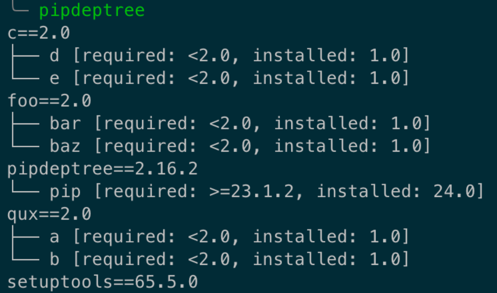

# The Unpredictability of SAT Solver-Based Dependency Resolution

## Introduction

Dependency resolution is something most programmers used frequently day to day. When you type `npm install`, `cargo add`, `conda install`, or whatever commands used by other package managers to manage dependencies, you quickly get the packages you want to install and you are happy. As for how package managers really did behind the scene to figure out what version of packages should be installed, who cares.

However, could you imagine that some package managers sometimes could give you really surprising resolution result? When you have different environments for development, testing and production, some package versions could be slightly different between these environment? In this article, I'll introduce how some of modern package managers could produce some very unexpected dependency resolution result, why could this happend and how could it cause problems.

## What is dependency resolution

But first of all, to keep all of us on the same page, here is some context about dependency resolution.

So when you are trying to develop some softwares, whether it is an application, a library or something else, you probably want to use some libraries written by others. However, the libraries you want to include, would usually depends on other libraries, and these sub-dependencies could have even further dependencies. Therefore, in order to successfully built and run your software, you have to install all the libraries (dependencies) you used in the project, then all of these libraries' dependencies, all of these libraries' dependencies' dependencies, etc, until all the dependencies have been installed and that could be a huge amount of packages.

Besides, each library usually asks for its dependency to be installed with a specific range of versions. Here is an example of dependency tree of a commonly used library in python, numpy:

    

As we can see, when we are installing numpy, we are actually installed a lot more packages than numpy: blas, libcxx, libopenblas, etc. And if we observe it clearly, we can see that after each installed package, there is an constraint behind it. For package libcxx, it is required to be installed with version >= 14.0.6. For package openssl, it is required to be installed with version >=1.1.1t and <1.1.2a. There are some other types of contraints here as well. For example, 5.\* means any version that starts with 5, \* means any version, and == means exact version.

And the issue of dependency resolution really comes when some packages depends on the same library, but with conflict versions.

Here is an example of a simple dependency and its dependency resolution process:

Let's say we have our **project** depends on three libraries:

-   package **bar** with any version

-   package **baz** with version >=2.0

-   package **qux** with version >=2.0

Then for package **bar**, we have three different versions:

-   **bar** version 3.0 depends on:

    -   package **qux** with version >=2.0

    -   package **baz** with version <2.0

-   **bar** version 2.0 depends on:

    -   package **qux** with version <2.0

-   **bar** version 1.0 depends on:

    -   package **qux** with any version

We try to built our **project**, so let's try to use **bar** with version 3.0 first. However, since **bar** 3.0 want **baz** <2.0, but our project want **baz**>=2.0, we would eventually fail to build it.

Then let's try with **bar** with version 2.0. And for the same reason, we would encounter an conflict on **qux**.

Finally, after trying with **bar** with version 1.0, we successfully found a combination of versions could won't lead to conflict.

This is a very simple example of what is dependency resolution doing. When you are installing packages using package managers, the package managers have to find a combination of versions of the packages that fulfill all the requirements specificed by each package, and also introduce no conflict.

## Anaconda Dependency Resolution Experiment

Ok, that's enough for the background context. Let's go back to the topic of the article: how some package managers could produce very unexpected dependency resolution result in some condition?

I've performed an experiment with anaconda as follows. I have created several packages:

Package **foo**:

-   **foo** version 1.0: depends on nothing

-   **foo** version 2.0: depends on **bar**<2.0 and **baz**<2.0

Package **bar**:

-   **bar** version 1.0: depends on nothing

-   **bar** version 2.0: depends on **foo**<2.0 and **baz**<2.0

Package **baz**:

-   **baz** version 1.0: depends on nothing

-   **baz** version 2.0: depends on **foo**<2.0 and **bar**<2.0

These three packages all have two different versions, version 1.0 and version 2.0. And their highest version is mutual exclusive, meaning the highest version of one package is conflict with highest version of other two packages. So only one of the highest version (version 2.0) of these packages could be installed, and other two packages have to choose the lower version (version 1.0).

I've created two other set of these packages (qux, a, b) and (c, d, e). These two sets (qux, a, b) and (c, d, e) have exactly the same properties and definitions of (foo, bar, baz).

Now let's try to install these packages together with anaconda and see what result we got:

`conda install --use-local foo bar baz qux a b c d e`

    

Ok, cool, anaconda found a solution to our dependencies, non-surprisingly.

Now, let's try to add another package in our dependencies. I've created a new package "dumb" with only one version availiable:

Package **dumb**:

-   **dumb** version 1.0: depends on **foo**<2.0 and **a**<2.0

So **dumb** depends on **foo**<2.0 and **a**<2.0. And remember in our previous resolution result, the chosen version of **foo** is already 1.0, and the chosen version of **a** is also already 1.0, which means all sub-dependencies of **dumb** is already fulfilled.

Let's add our new package "dumb" into our dependencies and try to install again.

`conda install --use-local foo bar baz qux a b c d e dumb`

    

Hmmm, looks like anaconda decided to give us a different resolution result. Specifically, the package version **b** and package version **qux** have changed. **But is this really expected?** Since we just added a package that has no conflict with current dependencies at all, and we got a different dependency resolution result. What if this behavior happened again in our real life projects? How could that cause issues?

## The Issue

From previous experiment, we already noticed that even adding some packages that has no conflict with current dependencies at all, we might get a competely different dependency resolution result. So what is a possible scenario that such behavior could cause problems?

There is indeed one very common scenario. When we are trying to build our softwares, usually there are at least three different environments that the software will be built: **The production environment**, **the testing environment** and **the production environment**.

These three environments always share some same packages that serves as the core packages of the entire software. However, they may also have slightly different packages than each other. In production environment, we might have some monitoring and alerting packages that is used for quickly finding the issues of the software. In testing environment, we might have some testing libraries that is used to perform some testing on the software. And in production environment, we could also have some additional packages that does jobs like code obfuscation. These additional packages required in different environment could just cause the behavior we mentioned before happen, and we will end up with different dependency resolution result in these different environment.

Different dependency resolution result means different version of some package get installed. Different version of the package means the package might behave differently. Imagine that because of the new testing library you added in your testing environment, some core packages' version is reolved differently between your testing environment and production environment, which means your production software is behaving differently but you are completely unaware of it!

When your software behaves differently, in best scenario, your code will not be able to build or run, and you can notice it and fix it immediately.

    

In the example above, the code will run successfully with Flask==2.2.5, but will get an ImportError with Flask==2.2.3.

However, things aren't always come with best case. Sometimes, different version of the package will not cause the code to fail to build. But instead, the code is running normally, but with different behavior.

    

In this example, if we run the code with either numpy==1.20.0 or numpy==1.19.5, there is no error at all. However, their output is different. With numpy==1.19.5, the output is `123 processed!`. However, with numpy==1.20.0, the if statement will never be evaluated to be true, and we get a different output `123`.

This could be a really serious problem. We are just using our package managers normally, but that could eventually break our CI/CD flow and let bugs, or even security issues in some worst cases, bypassed the testing stage and leaked into the production code.

So how to solve this issue? How can we get a more predictable and reasonable dependency resolution result? Before we get into here, we should definitely understand where the weird behavior comes from.

## Modern Dependency Resolution Algorithms

In order to fully understand what is going on when package managers resolves the dependencies, we first need to have the knowledge about how hard is the dependency resolution problem.

### Boolean satisfiability problem

Talking about a completely different problem while discussing about dependency resolution problem seems to be weird, but trust me, after you learnt about the Boolean satisfiability problem, we can make some connections between them.

Boolean satisfiability problem, also called SAT problem, is actually a very easy-to-understand problem. In this problem, you are given a boolean equation that only contains some boolean variables and three basic logic operations, OR, AND, NOT. And the task is just to assign TRUE or FALSE to these boolean variables to make the entire boolean equation be TRUE. Here is an example:

`E = (A OR B) AND ((NOT A) OR C) AND (B OR (NOT C)) AND ((NOT C) OR (NOT D))`

In this example, we need to assign **TRUE** or **FALSE** to variable **A**, **B**, **C** and **D** to make **E** become **TRUE**.

And since each variables has two options (**TRUE** or **FALSE**), and there are four variables in total, we actually have 2^4=16 possible combinations of variable to try. And we can see that as the number of variables goes up, the number of possible combinations also grows exponentially.

One of the answer to the above question could be found by simply trying: **A**=**FALSE**, **B**=**TRUE**, **C**=**FALSE** and **D**=**TRUE**. But what if there are so many variables? Remember even 32 boolean variables could produce 4294967296 possible combinations.

Actually this problem is an NP-hard problem and there is no existing algorithm that can solve it with worst time complexity smaller than O(2^n).

### Dependency Resolution Problem

Some people might already noticed that the SAT problem feels a little similar to our dependency resolution problem: they are all problems that want to try each boolean value/version to fulfill all the requirements. And you are right, these two problems are reducible. Below I'll give an example of how to convert a dependency resolution problem into a SAT problem.

I'll use the example from previous section:

**project** dependencies:

-   package **bar** with any version

-   package **baz** with version >=2.0

-   package **qux** with version >=2.0

Then for package **bar**, we have three different versions:

-   **bar** version 3.0 depends on:

    -   package **qux** with version >=2.0

    -   package **baz** with version <2.0

-   **bar** version 2.0 depends on:

    -   package **qux** with version <2.0

-   **bar** version 1.0 depends on:

    -   package **qux** with any version

We can convert it into the following boolean equation (notice that A -> B = NOT A OR B):

    VERSION(project)=

    ((bar_3.0 -> ((qux_2.0 OR qux_2.1 OR qux_higher-version) AND (baz_1.9 OR baz_1.8 OR baz_lower-version)))

    AND (bar_2.0 -> (qux_1.9 OR qux_1.8 OR qux_lower-version))

    AND (bar_1.0 -> (qux_2.1 OR qux_1.9 OR qux_any-version)))

    AND (baz_2.0 OR baz_2.1 OR baz_higher-version)

    AND (qux_2.0 OR qux_2.1 OR qux_higher-version)

This boolean equation specified the dependency relationship between the packages. For example, if package **bar** with version 3.0 is chosen (bar_3.0 -> ), then its subdependencies should be installed, i.e. package **qux** with version >=2.0 (qux_2.0 OR qux_2.1 OR qux_higher-version) and package **baz** with version <2.0 (baz_1.9 OR baz_1.8 OR baz_lower-version).

However, dependency relationship alone is not enough. We also want to have **exact one** version of the package being installed at the same time. Therefore, we could also add boolean equations to apply this restriction:

    (NOT bar_0.3 OR NOT bar_0.2) AND (NOT bar_0.3 OR NOT bar_0.1) AND (NOT bar_0.2 OR NOT bar_0.1)

This boolean statement only allows one version of **bar** exist, otherwise the statement will not be **TRUE**. Similar boolean statement could be constructed for package **baz** and **qux**.

Therefore, by adding these two parts of boolean statement together, we converted the dependency resolution problem into a SAT problem. Solving the SAT problem could give the dependency resolution result.

It is noteworthy that we could also convert any 3-SAT problem (a subset of SAT problem, also NP-hard) to the dependency resolution problem ([read more here](https://research.swtch.com/version-sat)). Therefore, we could say that the dependency resolution is also a NP-hard problem, which means if you find an algorithm that can resolves the dependency with polynomial time compleity, you proved P=NP.

### Anaconda Dependency Resolution

We have already seen an example of how to convert a dependency resolution problem into the SAT problem. So there is a question that: is this how all of the package managers did when we are trying to install packages? The answer is no.

Converting the dependency resolution problem into SAT problem, and then solve the SAT problem is one popular way of resolving the dependencies, though there are still additional things that needs to be considered when implementing it in practice, and I'll talk about it later. Some other methods of solving dependency resolution problem exists. One noteworthy one is **backtracking algorithm**, which has nothing to do with SAT problem.

But for now, let's still focus on solving dependency resolution problem by converting to SAT problems. Since this is exactly what anaconda did when you are trying to install packages with it.

#### Package Information Collection

Before constructing the SAT problems from dependency relationship, we first need to collect the packages we want to take into consideration when resolves the dependency. In case of anaconda, when you type `conda install`, it is actually not just the packages you listed after the command are sent to the collection, some other sources are:

-   Packages already present in your environment
-   Past actions you have performed in that environment (Extra protection to packages installed by it)
-   Aggressive updates list (packages that should be always up-to-date)
-   Ackages pinned to specific version in pinned_packages in .condarc
-   Default_packages if you are in a new environment
-   And finally, the packages user is asking for

Package information are collected from these sources, and some special treatment might be applied to some of them when convert to SAT problem. For example, for packages that are already present in the environment, we should try not to modify their version is not necessary.

#### SAT Clauses Transformation

After this point is where the converting process starts. And we have already seen an example of converting. But that is still not enough. There is one very important feature that exist in almost all the modern package managers when resolving the dependencies: we want to keep our installed package version as new as possible, since we definitely want to use newer version of the packages. And our boolean statement clearly does not have such constraint.

So how can we achieve the feature? Anaconda used a very smart approach. They assigned a weight for each version of the package. The key point is that the newer the version is, the smaller the weight will be assigned to the package. For example, **bar** version 3.0, the newest version of **bar**, will be assigned a weight of **0**. **bar** version 2.0 will be given the weight of **1**, and the oldest version 1.0 will be given the weight of **2**. Then we apply the same approach to all of the packages, and then add all of these weighted version together:

    Version Equation = (0 * bar_3.0 + 1 * bar_2.0 + 2 * bar_1.0) + (0 * baz_2.1 + 1 * baz_2.0 + ...) + (0 * qux_2.5 + 1 * qux_2.4 + ...)

Then, the task of making the install package version as new as possible becomes minimizing the **Version Equation**.

This **Version Equation** is actually something called **Pseudo-Boolean SAT**, which looks like this in general:

    C0 * p0 + C1 * p1 + . . . + Cn-1 * pn-1 ≥ Cn

It turns out that there is a systematic way to convert any Pseudo-Boolean SAT into a set of normal SAT expressions ([read more here](https://content.iospress.com/download/journal-on-satisfiability-boolean-modeling-and-computation/sat190021?id=journal-on-satisfiability-boolean-modeling-and-computation%2Fsat190021)), which means we could essentially convert our **Version Equation** into another part of SAT expressions, together with our SAT expressions for dependency relationship expressions.

Then in order to minimize the **Version Equation**, we can employ an approach called **Binary Decision Tree**, which basically works like binary search. Below is an example:

-   We first specify a upper bound of the **Version Equation**, say 100.
-   Then try to solve the SAT problem with 0 <= **Version Equation** <=100.
-   If we found any solution, we half the upper bound and try again,
-   Try to solve the SAT problem with 0 <= **Version Equation** <=50.
-   Found any solution? Half the upper bound.
-   Try to solve the SAT problem with 0 <= **Version Equation** <=25.
-   No solution found? Half the lower bound.
-   Try to solve the SAT problem with 12 <= **Version Equation** <=25.
-   ...

This process repeats until lower bound equals to upper bound, at which point the **Version Equation** is also minimized.

We can actually try to make the number of package installed minimized as well using similar approach. Anaconda is using **sorter network** to minimized the number of installed packages, which is faster than Binary Decision Tree in case of finding minimum number of installed packages.

At this point, we finally convert our high level dependency requirements into a set of boolean equations. And as long as we can solve this boolean equation, we get our dependency resolution result!

But someone may notice that during this entire process, there is no very _random_ things happened at all. Remember our goal is to find the source of the unpredictability of the dependency resolution result from anaconda, and if the _randomness_ is not introduced at this layer, then it should be introduced at the layer of solving SAT problem? And the answer is yes. The SAT Solver, algorithms used to solve SAT problems, is exactly where the _randomness_ is introduced to the system.

### SAT Solvers

Solving SAT problem has been a very popular topic for ages. One of the very old algorithm is called DPLL, which was introduced in 1961 by Martin Davis, George Logemann and Donald W. Loveland. This algorithm mainly employed two interesting optimizations: **Unit propagation** and **Pure literal elimination**.

Before we look into these two classic optimizations, let's first have a quick view about conjunctive normal form (CNF).

#### Conjunctive Normal Form

CNF form is a standardlized way to represent the boolean expressions used in SAT. It is very simple to understand, and below is a general CNF formated boolean equation:

    (an expression only contains OR or NOT) AND (an expression only contains OR or NOT) AND …

CNF form is basically transform and split the original boolean equations into a set of sub-expressions. In each sub-expression, only OR or NOT exists. Then AND each sub-expressions together and we get the CNF formatted boolean expression. It is interesting that every boolean equation could be transformed into this CNF form.

Then, in order to solve the SAT problem, we just need to make sure each sub-expression is evaluated to be TRUE.

#### Unit propagation

Unit propagation is a trick to reduce the search tree while trying the boolean variables when solving SAT problems. Let's consider the following sub-expressions that is part of a SAT problem in CNF form:

    (A OR B)
    (NOT B OR C)

When we are trying solutions with A set to False, we know that we must assign B to TRUE without trying, otherwise (A OR B) can not be TRUE. And once we assigned B to TRUE, we know that C has to be FALSE due to the same reason. And by applying this trick, we avoid of cost of searching unnecessary solution space.

#### Pure literal elimination

Pure literal elimination is another interesting optimization used in DPLL. Consider the following boolean equation:

    (A OR NOT B) AND (A OR B OR NOT C) AND (NOT B OR NOT C)

By observing, we can see that A always appears without NOT in front of it, so we can assign TRUE to A directly. Similar to C, where we can assign FALSE directly.

#### PicoSAT

Hopefully these two simple tricks used in SAT Solvers could help you to have a better insights about what SAT Solvers is trying to do when solve SAT problems.

Now SAT Solvers have evolved much more with a lot of amazing optimizations during these years. There is even a SAT competition every year that people from all over the world submitting their SAT Solvers to see who did the best job in solving SAT problems.

Back to Anaconda, we know that Anaconda is using SAT Solver to resolve the dependency. And **PycoSAT** is the exact SAT Solver used by Anaconda internally to solve the SAT problem.

**PycoSAT** is python binding of **PicoSAT**, which is a C program and does the actual work to solve the SAT problem.

So is the **PicoSAT** the source of the _randomness_ of the dependency resolution result produced by Anaconda?

Well, why not just perform another experiment on PicoSAT.

I downloaded a SAT problem with 250 boolean variables and 1065 sub-expressions. And let PicoSAT to solve. Below is the result I get:

    

Now let's play the same game. In the output, we see there is an **-1**, which means the **1st** boolean variable is assigned as **FALSE** (Number with no negative sign means that variable should be assigned **TRUE**). So let's add this result back to our SAT problem, like we are explicitly telling PicoSAT that the 1st variable is **FALSE**.

    

And we get a different result, just like what anaconda did for us in terms of dependency resolution result.

This is not surprising at all since this is how SAT Solver works. There are just too many black magic happened inside of the algorithm that made the algorithm almost become a chaos system. Can you believe that PicoSAT has over 5000 lines of code just to assign some boolean variables to make an boolean equation TRUE?

And what's even worse, there is an interesting optimization used in PicoSAT called **Random Restart**. And by the name, you might already know what is going on here: they are using a **random number generator** inside of the algorithm to randomly jump on the search tree.

    

The above code snippet is the exact random number generator used in PicoSAT.

To avoid confusion, the random number generator used inside of the PicoSAT is fix-seeded and the seed is always 0 if you do not explicitly ask it to change. So running the algorithm multiple times could give you the same result, but that fixed random sequence of number used inside of the algorithm still made the algorithm not preditable by nature.

But this is definitely not an issue of PicoSAT. Since the purpose of PicoSAT, as a SAT Solver, is just to find a solution to the SAT problem as quick as possible, and preditability of the result means nothing for the SAT problem.

But this is not always the case for some higher level applications that uses PicoSAT internally. Especially for the case of dependency resolution, preditability means the stability of the dependency resolution result, which hugely affects the final software stability.

## Predictable Dependency Resolution Algorithm

From the previous discussion and experiments, we see the importance of using a more predictable dependency resolution algorithm and how SAT solver based dependency resolution algorithm like the one Anaconda used could cause issue.

I actually already mentioned that besides SAT Solver based dependency resolution algorithm, there are other algorithms as well. So what's their performance in dependency resolution predictability?

### Experiment with pip

Let's apply the same experiment with pip, which uses **backtracking algorithm** to resolve the dependencies.

Same packages with same dependency relationship. With `pip install -i http://localhost:8080 foo bar baz qux a b c d e`, I got this result:

    
    

Let's add our **dumb** package. Since pip gives a little bit different result than anaconda, specifically, the version of **foo** is 2.0 here. So the dependencies of **dumb** looks like this:

Package **dumb**:

-   **dumb** version 1.0: depends on **e**<2.0 and **a**<2.0

Then we uninstall the packages and install again `pip install -i http://localhost:8080 foo bar baz qux a b c d e dumb`

    
    

And we get an exactly the same dependency resolution result!

### backtracking algorithm

So why would backtracking algorithm more predictable than SAT Solver?

Let's first see how backtracking algorithm works.

So backtracking algorithm is actually pretty straightforward. It just a simple depth-first-search that tries each package with newest version first, and if any conflict found during search, backtrack and use a slightly older version, until no conflict is found. There is no many fancy optimizations used here like SAT Solver, though some heuristics could be used during the backtracking to reduce the search tree.

And it is just such simplicity in algorithm that made backtracking has a very high predictability in dependency resolution result. Since in backtracking algorithm, only when there is any conflict happened, the backtracking process could happen. And if there is no conflict, then nothing special would happen and this package is installed directly.

The backtracking algorithm indeed seems to be very primitive compare with SAT Solver based dependency resolution algorithm. But that does not mean backtracking is always bad than SAT Solver. Backtracking algorithm is still widely deployed in popular package managers like Python's pip, Rust Cargo, Swift Package Manger, etc, so there is no big issues with backtracking algorithm at all.

## Conclusion

The conclusion of this article is definitely not about "SAT Solver based dependency resolution algorithm is bad, do not use it. Use backtracking instead". Admittedly, due to the extremely high optimization used in SAT Solver, the performance of SAT Solver would be faster than backtracking algorithm in average. But the gap is not that unacceptable. Remember that in anaconda, in order to get the newest possible versions of package installed, there are actually many times of the SAT Solver being ran, comparing with backtracking algorithm that can find newest possible versions directly. And in many cases where there are not many packages present in your environment, there isn't much difference in performance between SAT Solver and backtracking algorithm.

The purpose of this article is to mainly illustrate that there is a minor issue with SAT Solver based dependency resolution algorithm, that could possibly cause serious issues in some cases. It might be a wise decision to take special care about the dependency versions installed between different environments, especially if you are using SAT Solver based dependency resolution algorithm like the one Anaconda used.

Possible improvements on SAT Solver algorithm itself might also be an interesting topic. If there is a specilized SAT Solver that is designed for scenario where predictability is important, that could be a huge addition to current dependency resolution system.
